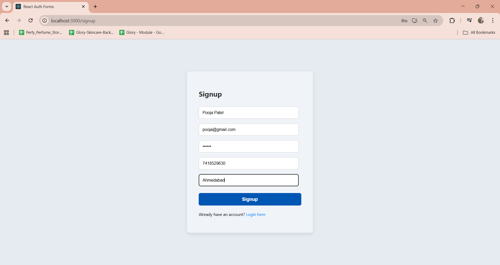
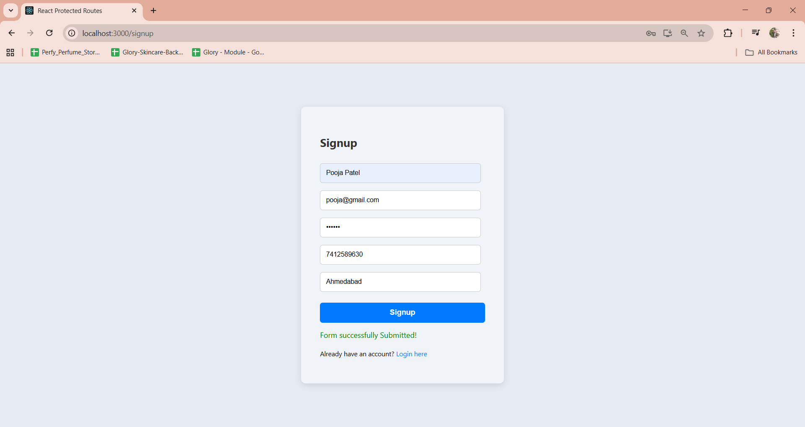
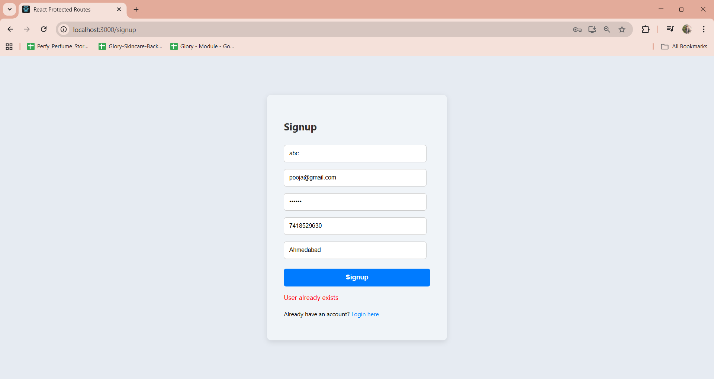
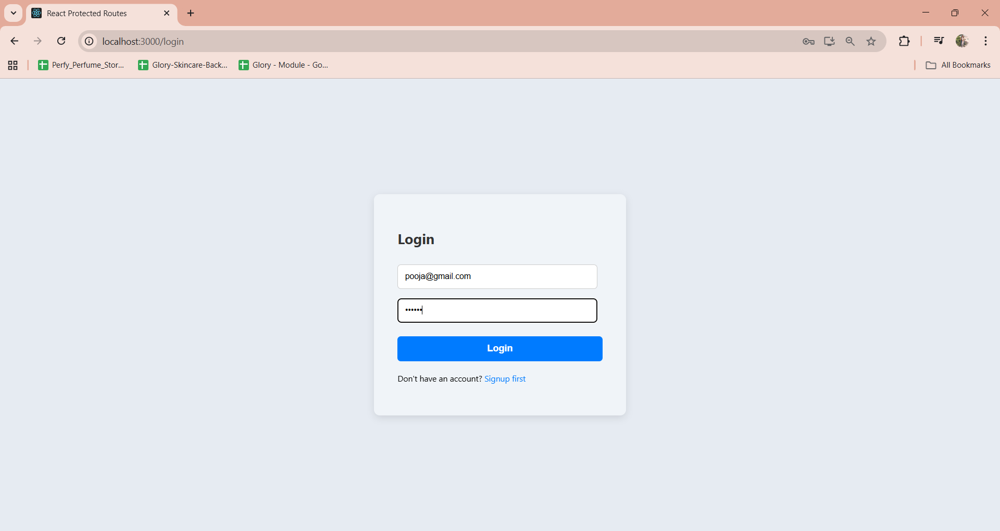
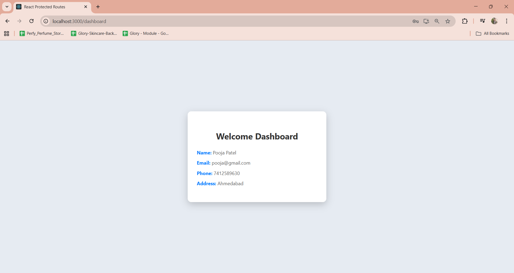
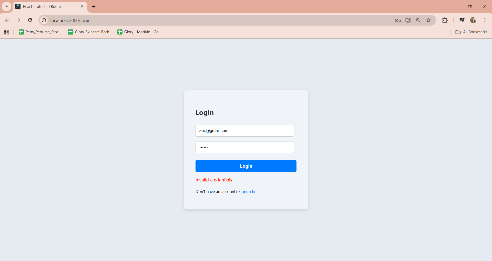
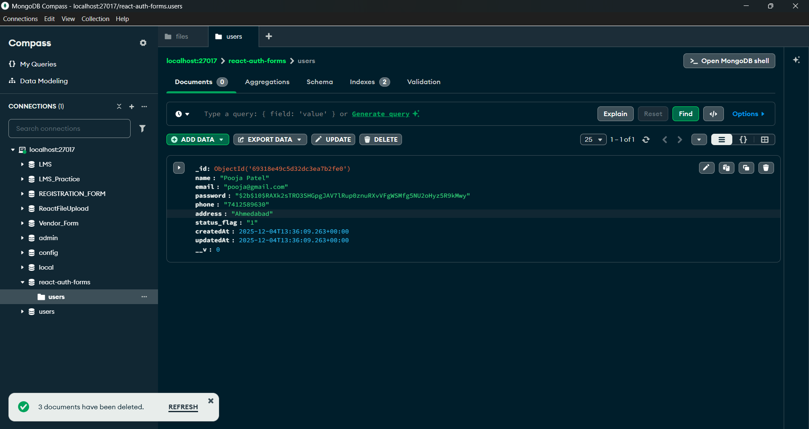

---

# 📂 React Protected Routes

A simple and clean **React + Node.js + MongoDB authentication system** where users can **signup, login, and access protected pages**. The frontend communicates with the backend API via **Axios** and uses **JWT tokens** to secure routes.

---

## 📸 Screenshots

### **Signup Page**



### **Success Signup**



### **Error Signup**



### **Login Page**



### **Success Login**



### **Error Login**



### **Dashboard Page**


### **MongoDB**



---

## ⭐ Features

* **User signup** with frontend & backend validation (email, password, phone number)
* **User login** with JWT authentication
* **Protected routes** – only logged-in users can access the dashboard
* **Error messages** for invalid credentials or duplicate email
* **Redirect** after successful signup/login
* **Clean React UI** with responsive forms
* **Axios** for API communication
* **Node.js + Express backend** with MongoDB
* Passwords hashed with **bcrypt**
* JWT tokens stored in **localStorage**
* **Environment variable setup**

---

## 🔄 Authentication Flow

1. **Signup**

   * User fills the signup form.
   * Frontend validation checks required fields, email format, password length, phone digits.
   * POST request to `/api/auth/signup`.
   * If successful, JWT token is stored in localStorage, user redirected to **Login page**.
   * If failed (duplicate email or invalid input), shows **Error Signup** popup.

2. **Login**

   * User fills the login form.
   * POST request to `/api/auth/login`.
   * If successful, JWT token stored in localStorage, user redirected to **Protected Dashboard**.
   * If failed (wrong credentials), shows **Error Login** popup.

3. **Protected Routes**

   * Dashboard route is protected using `PrivateRoute` component.
   * If user is **not logged in** (no valid JWT in localStorage), redirect to **Login** page.
   * If user is **logged in**, fetch user profile from `/api/users/profile` using token.
   * User data displayed in the dashboard.

---

## 🛠 Technologies

**Frontend:** React, Axios, React Router, CSS
**Backend:** Node.js, Express.js, MongoDB, Mongoose, bcryptjs, JWT
**Other:** Nodemon, dotenv, cors

---

## 📁 Folder Structure

```
react-auth-forms/
│
├── backend/
│   ├── config/db.js  
│   ├── models/User.js           
│   ├── routes/authRoutes.js    
│   ├── routes/userRoutes.js
│   ├── controllers/authController.js  
│   ├── controllers/userController.js
│   ├── middlewares/authMiddleware.js
│   ├── middlewares/errorHandler.js 
│   ├── server.js             
│   └── .env                    
│
└── frontend/
    ├── src/
    │   ├── components/Signup.jsx
    │   ├── components/Login.jsx
    │   ├── components/Dashboard.jsx
    │   ├── components/PrivateRoute.jsx
    │   ├── style/Form.css
    │   ├── style/Dashboard.css
    │   ├── App.js
    │   └── index.js
    ├── public/
    └── .env                     # Frontend environment variables
```

---

## 🚀 Installation Guide

### 1️⃣ Frontend Setup

```bash
npx create-react-app frontend
cd frontend
npm install axios react-router-dom
npm start
```

Frontend runs at: **[http://localhost:3000](http://localhost:3000)**

---

### 2️⃣ Backend Setup

1. Create and enter the backend folder:

```bash
mkdir backend
cd backend
```

2. Initialize Node.js project:

```bash
npm init -y
```

3. Install backend dependencies:

```bash
npm install express mongoose bcryptjs jsonwebtoken dotenv cors nodemon
```

4. Add a `dev` script in `package.json`:

```json
"scripts": {
  "dev": "nodemon server.js"
}
```

5. Create `.env` file in backend:

```
PORT=5000
MONGO_URI=mongodb://localhost:27017/reactauth
JWT_SECRET=your_secret_key
```

6. Start the backend server:

```bash
npm run dev
```

Backend runs at: **[http://localhost:5000](http://localhost:5000)**

---

## 🔗 API Endpoints

| Method | Endpoint             | Description                          |
| ------ | -------------------- | ------------------------------------ |
| POST   | `/api/auth/signup`   | Register new user                    |
| POST   | `/api/auth/login`    | Login user & get JWT                 |
| GET    | `/api/users/profile` | Get current user profile (protected) |

---

## 📜 Form Validation Rules

* **Name:** Required
* **Email:** Valid Gmail format
* **Password:** Minimum 6 characters
* **Phone:** 10 digits only
* **Address:** Required

> Invalid input will show **error messages** on the frontend popup.

---

## 🧠 What You Will Learn

* Structuring a React + Node.js project
* JWT-based authentication
* Password hashing with bcrypt
* API communication with Axios
* Form validation and error handling
* Protected routes using React Router
* MongoDB + Mongoose setup
* Environment variable management

---

